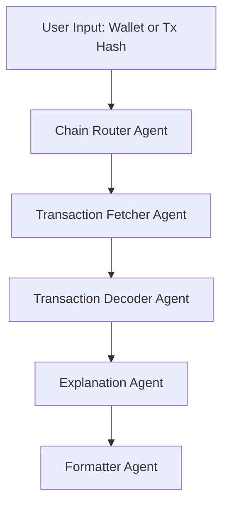

# 🪙 Tx Lens — AI-Powered Crypto Transaction Explainer

Tx Lens is an AI system that converts raw blockchain transactions into **clear, human-readable explanations**.

## 🚀 MVP Features

### 🧱 Core Flow

1. **User provides:**

   - A wallet address
     **or**
   - A transaction hash

2. **Tx Lens fetches on-chain data** using provider APIs:

   - Etherscan / Blockscout
   - Solana RPC
   - (Easily extensible to additional chains)

3. **Explanation Agent**
   - Interprets the transaction
   - Produces a simplified, natural-language explanation

**Example output:**

> “You swapped **0.2 ETH for 350 USDC** on **Uniswap v3**.
> Gas fees were **$14.25**.”

---

## 📈 Scalable Multi-Agent Architecture

### **1. Chain Router Agent**

- Detects the chain from the input
- Routes to the correct RPC/API provider
- Normalizes chain-specific responses

### **2. Transaction Fetcher Agent**

Retrieves:

- Raw transaction
- Transaction receipt
- Event logs

Outputs a **unified internal transaction format**.

### **3. Transaction Decoder Agent**

- Interprets function signatures
- Decodes logs and events
- Classifies transaction type (swap, transfer, NFT mint, etc.)

### **4. Explanation Agent**

- Summarizes what happened
- Adds context: DEX, token symbols, USD values, protocol names

### **5. Formatter Agent**

Produces structured outputs:

- Markdown
- JSON
- Rich messages for UI components

---

## 🔍 Optional Additional Agents (MVP+)

### **6. Fee Breakdown Agent**

Provides a detailed view:

- Base fee
- Priority fee
- Gas used
- Estimated USD cost

### **7. Contract Interaction Agent**

- Decodes ABI methods
- Explains the contract’s purpose
- Summarizes all contract-level actions

---

## 🧱 Architecture Diagram (Mermaid)

